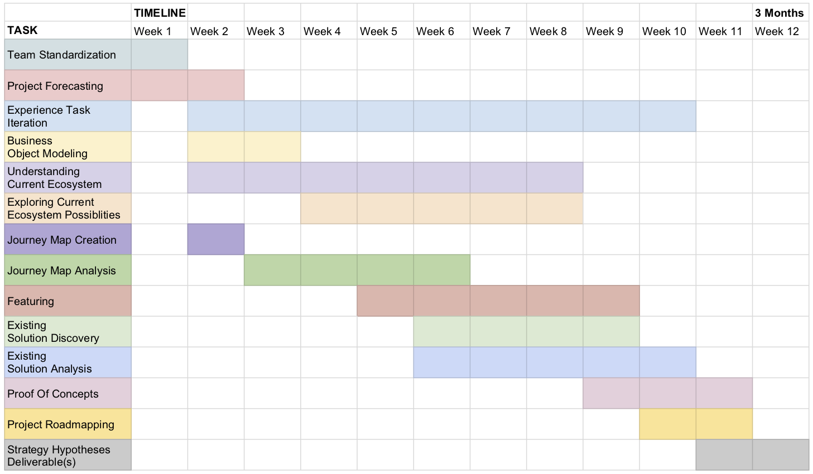
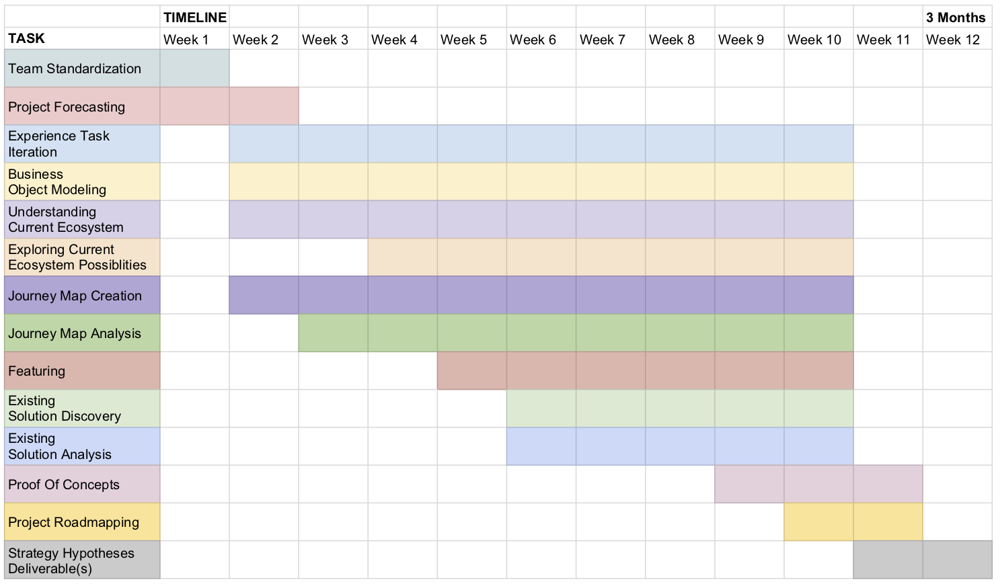
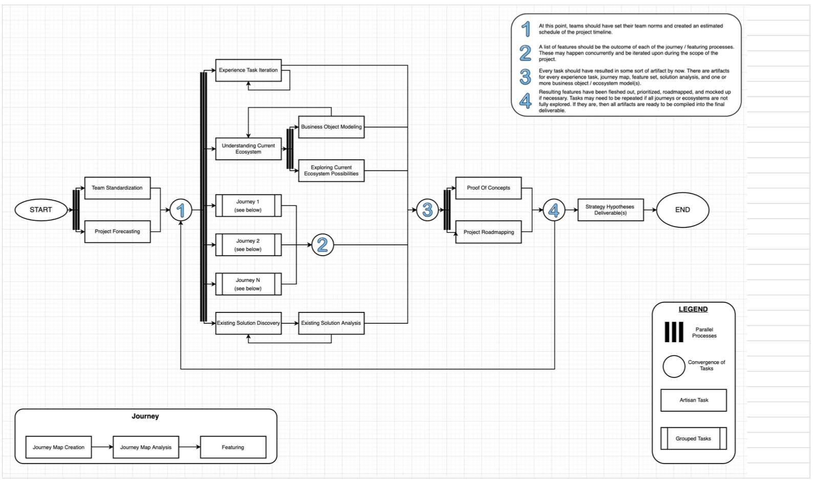

# Timeline Illustrations

Expeditions tasks can be accomplished in a variety of sequences. What is illustrated below are proposed timelines in which events may happen. The events are presented in a linear matter, but are not reliant on the completion of the preceding task. However, some artifacts support future tasks. For example, you cannot really begin Existing Solution Discovery or Analysis without fleshing out at least some Solution Concepts during the Featuring task. The beginning of projects do require discrete linear steps due to the need for team standardization and expectation setting necessary for success. Once these basic steps are completed then artifacts and processes can be iterated upon, thus allowing work to flow without impediment.

Example of Expedition with one journey. This shows when tasks may be started and completed.

Example of ongoing maintenance for Expedition. Once a task is started, the artifacts produced will be continuously iterated on as new information is learned and project goals are adjusted.

Example of possible Expedition workflow with multiple journey maps in parallel development.
